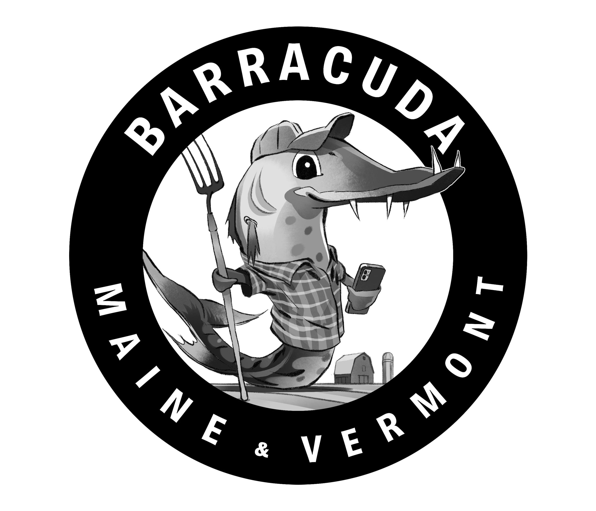
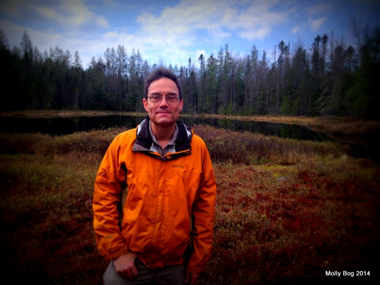
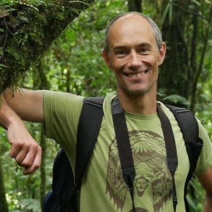

## About Us

### Barracuda: Biodiversity And RuRal Adaptation to Climate change Using Data Analysis 

[Barracuda](https://biobarracuda.org/) is a research project funded by a National Science Foundation EPSCoR grant, and is a collaboration between two research groups at the University of Maine (UM) and the University of Vermont (UVM). Barracuda stands for “Biodiversity and Rural Response to Climate Change Using Data Analysis.”

These data science resources are compiled from lectures and educational materials from Drs. Nicholas Gotelli, Tim Waring, and Matt Dube.

### Dr. Gotelli 

Dr. Nicholas Gotelli is a Professor of Biology at the University of Vermont. His research on plants and invertebrates addresses how populations and communities are assembled and organized in space and time. His published books include Null Models in Ecology (1996; with Gary Graves), A Primer of Ecology (2008; 4th edition), A Primer of Ecological Statistics (2012; 2nd edition; with Aaron Ellison), and the R package EcoSimR (2015; with Ted Hart and Aaron Ellison). His contribution of materials for this repository were originally created as remote learning tools for his Computational Biology course. His website and more information about his research and teaching can be found [here](https://www.uvm.edu/~ngotelli/homepageback.html).

### Dr. Waring

Dr. Tim Waring is an Associate Professor of Social-Ecological Systems Modeling at the University of Maine. Dr. Waring studies how cooperation and culture determine social and environmental outcomes. He builds and tests evolutionary models of social and economic change to learn how sustainable behaviors and durable institutions arise and persist. He uses behavioral and economic experiments and agent-based simulations. He has led the development of an evolutionary theory of sustainability and apply it to case studies around the world. Waring also received a prestigious CAREER grant from the National Science Foundation and leads an international working group on evolutionary approaches to sustainability. Current projects include the evolution of co-operative organizations, the patterns and processes of long-term human evolution, cultural adaptation to climate change among US Farmers to climate change. His contribution of materials for this repository were originally created for his [XXXX] courses. His website and more information about his research and teaching can be found [here](https://timwaring.info/).

### Dr. Dube

Dr. Matthew Dube is an Assistant Professor of Computer Information Systems at the University of Maine at Augusta, where his research focuses on geospatial reasoning and data science as they apply to real world problems and systems. His teaching centers on concepts core to data science, be it database design, geographic information systems, interdisciplinary data science, data visualization, machine learning, and fundamental programming.  He also teaches courses in human computer interaction, interdisciplinary studies, public management, and geography. His website and more information about his research and teaching can be found [here](https://www.uma.edu/directory/staff/matthew-p-dube/)

# Available Resources 

## Introduction to Computational Programming  
A summary of what topics are covered. 

### subheading  

* [link to another page]() 
* [link to another page]() 

### subheading   

* [link to another page]()   
* [link to another page]() 

## Computational Data Management and Wrangling

## Data Visualization

## Data Analysis  

### Introduction to experimental design and statistical distributions

* [Experimental Design](Stats_ExpDesign.html)  
* [Probability](Stats_Probability.html)
* Discrete Distributions  
* Continuous Distributions

### Inferential statistics and hypothesis testing 

* Estimating parameters  
* Basics of hypothesis testing   

